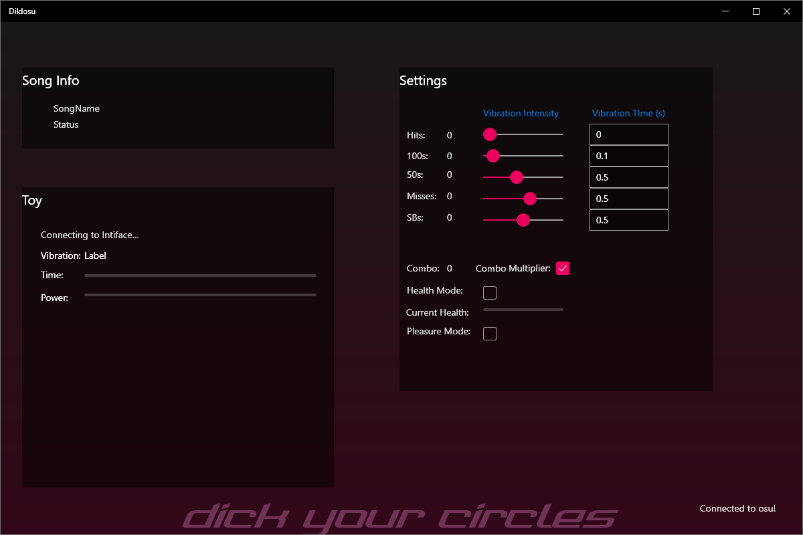

# Dildosu

> Dick your circles.

Dildosu is a Windows desktop app that drives Lovense (and other Buttplug‑compatible) toys based on what is happening in your [osu!](https://osu.ppy.sh/) session. It reads gameplay state from [gosumemory](https://github.com/l3lackShark/gosumemory) and turns hits, misses, slider breaks, combo, and HP into vibration commands sent through [Intiface Central](https://intiface.com/central/) / the [Buttplug](https://buttplug.io/) protocol.



## Features

- Per‑event vibration intensity and duration sliders for:
  - 300s (clean hits)
  - 100s
  - 50s
  - Misses
  - Slider breaks
- **Combo Multiplier** &mdash; misses/slider breaks vibrate harder and longer the more combo you just dropped.
- **Health Mode** &mdash; vibration scales with how low your HP is (panic mode).
- **Pleasure Mode** &mdash; ignores discrete hit events and vibrates continuously based on current combo.
- Auto‑stops and clears the queue when you are not actively playing a map.
- Live UI showing the current vibration, intensity, remaining time, and queued actions.

## How it works

```
osu!  ──►  gosumemory  ──(WebSocket /tokens)──►  Dildosu  ──(Buttplug WS)──►  Intiface Central  ──(BLE)──►  Toy
```

1. **gosumemory** scrapes the osu! process and exposes gameplay tokens over a local WebSocket.
2. **Dildosu** subscribes to a fixed set of tokens (`combo`, `c300`, `c100`, `c50`, `miss`, `sliderBreaks`, `playerHp`, `status`, `mapArtistTitle`, `mAR`) and converts deltas into `VibrationAction`s.
3. Actions go through a queue consumer that talks to **Intiface Central** via the Buttplug C# client, which then drives the toy.

## Requirements

- Windows 10 (build 18362) or newer
- [.NET 6 SDK](https://dotnet.microsoft.com/download/dotnet/6.0) (Desktop / WPF workload) &mdash; only needed to build from source
- [osu!](https://osu.ppy.sh/)
- [gosumemory](https://github.com/l3lackShark/gosumemory) running locally
- [Intiface Central](https://intiface.com/central/) (formerly Intiface Desktop) running locally
- A [Buttplug‑supported toy](https://iostindex.com/?filter0Availability=Available&filter1Connection=Digital&filter2ButtplugSupport=4) (Lovense, etc.)

## Setup

### 1. gosumemory

Install gosumemory and start it before launching the game. Dildosu connects to:

```
ws://localhost:20727/tokens
```

Edit `gosumemory`'s `config.ini` so the server listens on port **20727**:

```ini
[server]
port = 20727
```

(Default gosumemory port is 24050 &mdash; you must change it to match, or this app will not connect.)

### 2. Intiface Central

1. Install and launch Intiface Central.
2. Under **Server Settings**, set the Websocket server to:
   - Host: `localhost`
   - Insecure Websocket port: `6969`
   - Endpoint path: `/buttplug`
3. Start the server, pair your toy, and leave it running.

Dildosu connects to:

```
ws://localhost:6969/buttplug
```

### 3. Dildosu

#### Run a prebuilt copy

Drop the published binaries in any folder and run `Dildosu.exe`.

#### Build from source

```bash
git clone <this-repo>
cd Dildosu
dotnet build -c Release
```

Or open `Dildosu.sln` in Visual Studio 2022 and hit F5.

## Usage

1. Start Intiface Central and connect your toy.
2. Start gosumemory.
3. Start osu! and load into a map.
4. Launch Dildosu. The top‑right shows the toy connection status.
5. Tune the per‑event intensity sliders (0&ndash;20) and time boxes (seconds) in **Settings**.
6. Optional modes:
   - **Combo Multiplier** &mdash; multiplies miss/SB intensity and time by `1 + prevCombo/50`.
   - **Health Mode** &mdash; replaces the event‑driven queue with continuous HP‑based vibration.
   - **Pleasure Mode** &mdash; replaces the event‑driven queue with continuous combo‑based vibration (`min(20, combo/10)`).

When the play state leaves "playing" (gosumemory `status` &ne; 2), the queue is flushed and the toy is stopped.

## Project layout

```
Dildosu/
├── Dildosu.sln
└── Dildosu/
    ├── App.xaml / App.xaml.cs        WPF entry point
    ├── MainWindow.xaml / .cs         UI + osu! token handling + vibration queue
    ├── ButtplugConnector.cs          Intiface/Buttplug client + device scan
    ├── Dildosu.csproj                .NET 6 WPF project
    └── dildo.png                     Window icon
```

## Disclaimer

This software controls adult products. By using it you agree that:

- You are of legal age to use such devices in your jurisdiction.
- You understand that misconfigured intensities/durations can be uncomfortable or unsafe &mdash; start low.
- The authors take no responsibility for any harm, embarrassment, or ruined ranked plays.

## Acknowledgements

- [Buttplug](https://buttplug.io/) / Intiface by qDot &mdash; the protocol and runtime making this possible.
- [gosumemory](https://github.com/l3lackShark/gosumemory) &mdash; for exposing osu! state.
- [ModernWpfUI](https://github.com/Kinnara/ModernWpf) &mdash; UI styling.
